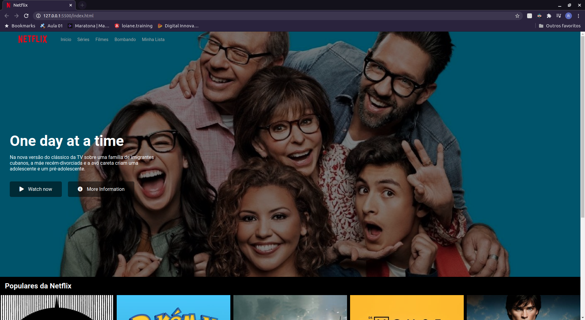
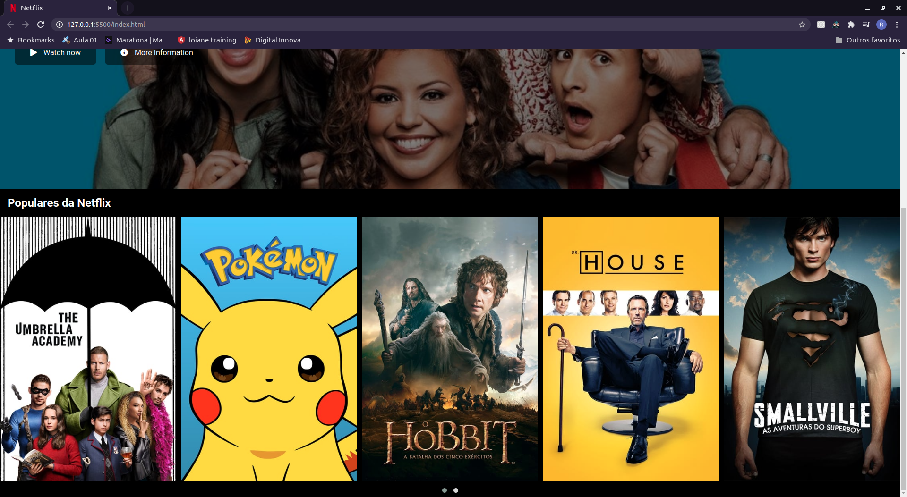

# DIO-projects

----
## Netflix
O primeiro projeto desenvolvido no bootcamp é a cópia da Netflix, em HTML, CSS e JavaScript apenas. É uma cópia de forma simplificada realizada no intuito de adquirir conhecimentos sobre as tecnologias citadas anteriormente.

    <h3>Home page</h3>
    
    <h3>Home page continue</h3>
    

